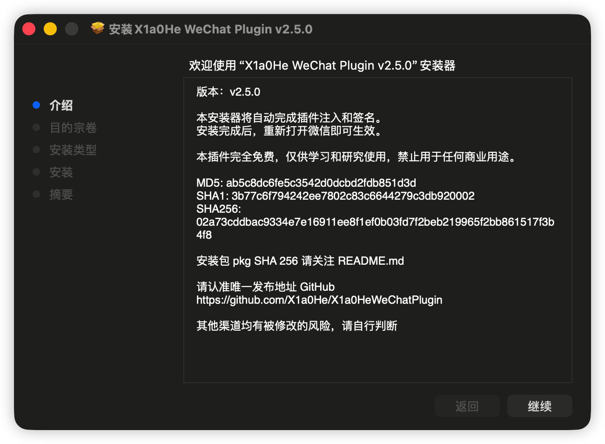
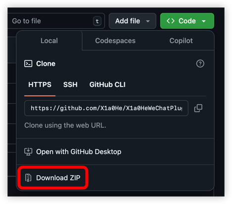
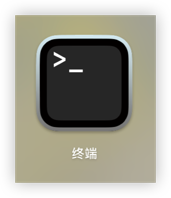
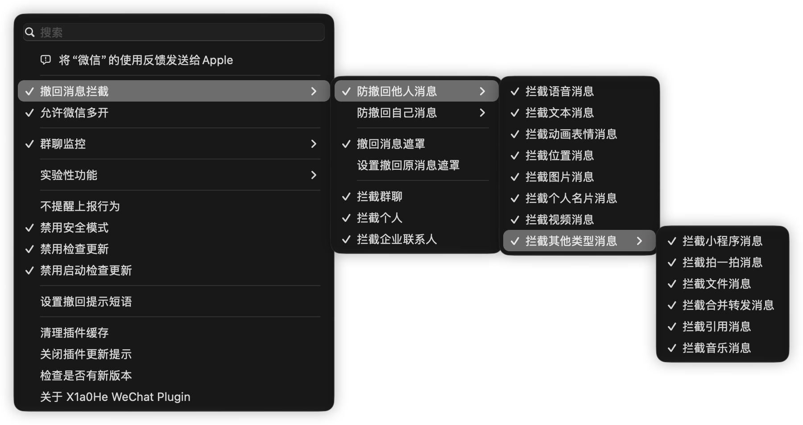
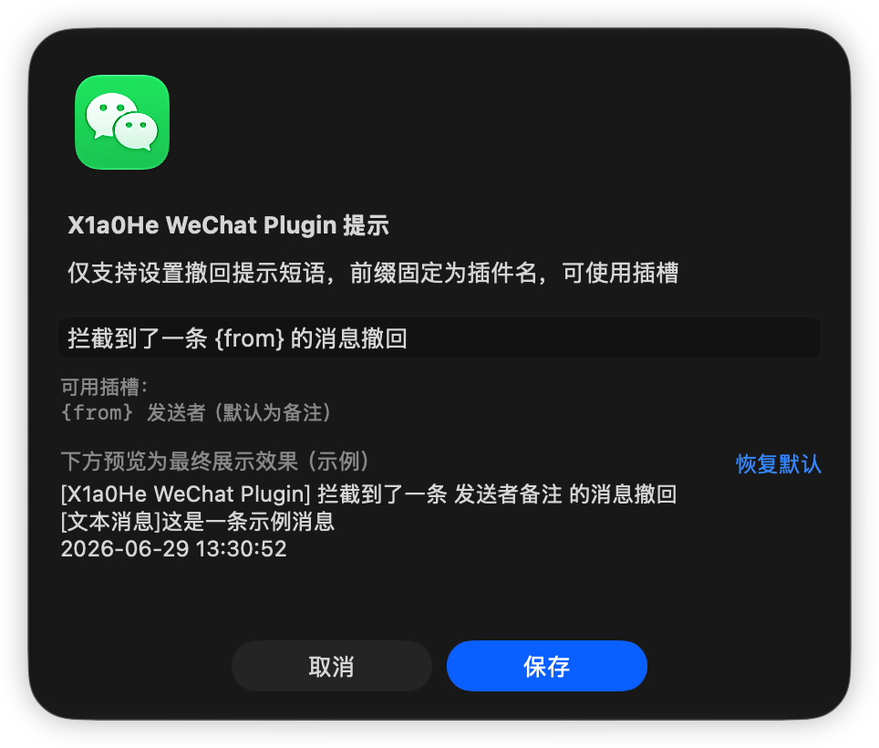
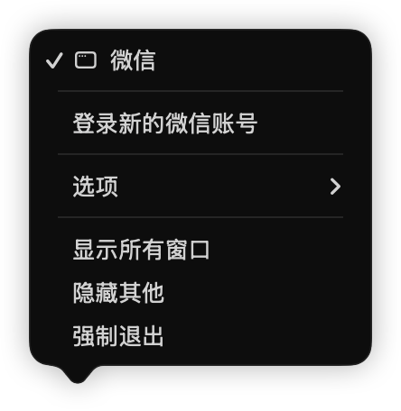

# X1a0He Plugin 2 for macOS


[](https://github.com/X1a0He/X1a0HeWeChatPlugin/releases)


macOS 客户端插件


> ✅ 已在以下环境中测试通过\
> 💻 设备: M1 Max macOS Tahoe 26.5 Beta (25F5058e)\
> 📒 微信版本: 4.1.9.57(38937)\
> ❌ 不支持 Intel 版本\
> ❌ 不支持 MAS 版本
> 
> MD5: 4afaf62c0d47f1f2fde7c19dbbb2fa5a\
> SHA1: 757dbaad8ac116f7f8e0ef4d0347c5340960a3e2\
> SHA256: e52ddcaa1f7190e898e3a38348bef2077711a9138a4a8503886f3291ef72076e
> 
> 安装包 pkg SHA 256: 20a685605970a54c7b2935c2086985c178ae63dc3fdca61f8891c26777b6253f

# 支持版本(点击版本或立即下载即可下载原版)
[版本记录](https://github.com/X1a0He/X1a0HeWeChatPlugin/issues/43)

|                                                 版本                                                 |  版本号  | 支持 | Arm | Intel | 需要插件版本 | 下载原版                                                                                          |
|:--------------------------------------------------------------------------------------------------:|:-----:|:--:|:---:|:-----:|:------:|-----------------------------------------------------------------------------------------------|
|  [4.1.7.56](https://dldir1v6.qq.com/weixin/Universal/Mac/xWeChatMac_universal_4.1.7.56_34878.dmg)  | 34878 | ✅  |  ✅  |   ✅   |   -    | [立即下载](https://dldir1v6.qq.com/weixin/Universal/Mac/xWeChatMac_universal_4.1.7.56_34878.dmg)  |
|  [4.1.7.57](https://dldir1v6.qq.com/weixin/Universal/Mac/xWeChatMac_universal_4.1.7.57_34888.dmg)  | 34888 | ✅  |  ✅  |   ✅   |   -    | [立即下载](https://dldir1v6.qq.com/weixin/Universal/Mac/xWeChatMac_universal_4.1.7.57_34888.dmg)  |
|  [4.1.8.21](https://dldir1v6.qq.com/weixin/Universal/Mac/xWeChatMac_universal_4.1.8.21_36420.dmg)  | 36420 | ✅  |  ✅  |   ❌   | 2.1.9  | [立即下载](https://dldir1v6.qq.com/weixin/Universal/Mac/xWeChatMac_universal_4.1.8.21_36420.dmg)  |
|  [4.1.8.22](https://dldir1v6.qq.com/weixin/Universal/Mac/xWeChatMac_universal_4.1.8.22_36451.dmg)  | 36451 | ✅  |  ✅  |   ❌   | 2.1.9  | [立即下载](https://dldir1v6.qq.com/weixin/Universal/Mac/xWeChatMac_universal_4.1.8.22_36451.dmg)  |
|  [4.1.8.23](https://dldir1v6.qq.com/weixin/Universal/Mac/xWeChatMac_universal_4.1.8.23_36507.dmg)  | 36507 | ✅  |  ✅  |   ❌   | 2.1.9  | [立即下载](https://dldir1v6.qq.com/weixin/Universal/Mac/xWeChatMac_universal_4.1.8.23_36507.dmg)  |
|  [4.1.8.26](https://dldir1v6.qq.com/weixin/Universal/Mac/xWeChatMac_universal_4.1.8.26_36552.dmg)  | 36552 | ✅  |  ✅  |   ❌   | 2.1.9  | [立即下载](https://dldir1v6.qq.com/weixin/Universal/Mac/xWeChatMac_universal_4.1.8.26_36552.dmg)  |
|  [4.1.8.27](https://dldir1v6.qq.com/weixin/Universal/Mac/xWeChatMac_universal_4.1.8.27_36559.dmg)  | 36559 | ✅  |  ✅  |   ❌   | 2.1.9  | [立即下载](https://dldir1v6.qq.com/weixin/Universal/Mac/xWeChatMac_universal_4.1.8.27_36559.dmg)  |
|  [4.1.8.28](https://dldir1v6.qq.com/weixin/Universal/Mac/xWeChatMac_universal_4.1.8.28_36571.dmg)  | 36571 | ✅  |  ✅  |   ❌   | 2.1.9  | [立即下载](https://dldir1v6.qq.com/weixin/Universal/Mac/xWeChatMac_universal_4.1.8.28_36571.dmg)  |
|  [4.1.8.29](https://dldir1v6.qq.com/weixin/Universal/Mac/xWeChatMac_universal_4.1.8.29_36603.dmg)  | 36603 | ✅  |  ✅  |   ❌   | 2.1.9  | [立即下载](https://dldir1v6.qq.com/weixin/Universal/Mac/xWeChatMac_universal_4.1.8.29_36603.dmg)  |
|  [4.1.8.50](https://dldir1v6.qq.com/weixin/Universal/Mac/xWeChatMac_universal_4.1.8.50_36728.dmg)  | 36728 | ✅  |  ✅  |   ❌   | 2.1.9  | [立即下载](https://dldir1v6.qq.com/weixin/Universal/Mac/xWeChatMac_universal_4.1.8.50_36728.dmg)  |
|  [4.1.8.51](https://dldir1v6.qq.com/weixin/Universal/Mac/xWeChatMac_universal_4.1.8.51_36777.dmg)  | 36777 | ✅  |  ✅  |   ❌   | 2.1.9  | [立即下载](https://dldir1v6.qq.com/weixin/Universal/Mac/xWeChatMac_universal_4.1.8.51_36777.dmg)  |
|  [4.1.8.52](https://dldir1v6.qq.com/weixin/Universal/Mac/xWeChatMac_universal_4.1.8.52_36830.dmg)  | 36830 | ✅  |  ✅  |   ❌   | 2.1.9  | [立即下载](https://dldir1v6.qq.com/weixin/Universal/Mac/xWeChatMac_universal_4.1.8.52_36830.dmg)  |
|  [4.1.8.66](https://dldir1v6.qq.com/weixin/Universal/Mac/xWeChatMac_universal_4.1.8.66_36675.dmg)  | 36675 | ✅  |  ✅  |   ❌   | 2.1.9  | [立即下载](https://dldir1v6.qq.com/weixin/Universal/Mac/xWeChatMac_universal_4.1.8.66_36675.dmg)  |
|  [4.1.8.67](https://dldir1v6.qq.com/weixin/Universal/Mac/xWeChatMac_universal_4.1.8.67_36677.dmg)  | 36677 | ✅  |  ✅  |   ❌   | 2.1.9  | [立即下载](https://dldir1v6.qq.com/weixin/Universal/Mac/xWeChatMac_universal_4.1.8.67_36677.dmg)  |
|  [4.1.8.97](https://dldir1v6.qq.com/weixin/Universal/Mac/xWeChatMac_universal_4.1.8.97_37189.dmg)  | 37189 | ✅  |  ✅  |   ❌   | 2.1.9  | [立即下载](https://dldir1v6.qq.com/weixin/Universal/Mac/xWeChatMac_universal_4.1.8.97_37189.dmg)  |
|  [4.1.8.98](https://dldir1v6.qq.com/weixin/Universal/Mac/xWeChatMac_universal_4.1.8.98_37222.dmg)  | 37222 | ✅  |  ✅  |   ❌   | 2.1.9  | [立即下载](https://dldir1v6.qq.com/weixin/Universal/Mac/xWeChatMac_universal_4.1.8.98_37222.dmg)  |
| [4.1.8.100](https://dldir1v6.qq.com/weixin/Universal/Mac/xWeChatMac_universal_4.1.8.100_37261.dmg) | 37261 | ✅  |  ✅  |   ❌   | 2.1.9  | [立即下载](https://dldir1v6.qq.com/weixin/Universal/Mac/xWeChatMac_universal_4.1.8.100_37261.dmg) |
| [4.1.8.101](https://dldir1v6.qq.com/weixin/Universal/Mac/xWeChatMac_universal_4.1.8.101_37293.dmg) | 37293 | ✅  |  ✅  |   ❌   | 2.1.9  | [立即下载](https://dldir1v6.qq.com/weixin/Universal/Mac/xWeChatMac_universal_4.1.8.101_37293.dmg) |
| [4.1.8.104](https://dldir1v6.qq.com/weixin/Universal/Mac/xWeChatMac_universal_4.1.8.104_37303.dmg) | 37303 | ✅  |  ✅  |   ❌   | 2.1.9  | [立即下载](https://dldir1v6.qq.com/weixin/Universal/Mac/xWeChatMac_universal_4.1.8.104_37303.dmg) |
| [4.1.8.105](https://dldir1v6.qq.com/weixin/Universal/Mac/xWeChatMac_universal_4.1.8.105_37331.dmg) | 37331 | ✅  |  ✅  |   ❌   | 2.1.9  | [立即下载](https://dldir1v6.qq.com/weixin/Universal/Mac/xWeChatMac_universal_4.1.8.105_37331.dmg) |
| [4.1.8.106](https://dldir1v6.qq.com/weixin/Universal/Mac/xWeChatMac_universal_4.1.8.106_37335.dmg) | 37335 | ✅  |  ✅  |   ❌   | 2.1.9  | [立即下载](https://dldir1v6.qq.com/weixin/Universal/Mac/xWeChatMac_universal_4.1.8.106_37335.dmg) |
|  [4.1.9.21](https://dldir1v6.qq.com/weixin/Universal/Mac/xWeChatMac_universal_4.1.9.21_37997.dmg)  | 37997 | ✅  |  ✅  |   ❌   | 2.2.0  | [立即下载](https://dldir1v6.qq.com/weixin/Universal/Mac/xWeChatMac_universal_4.1.9.21_37997.dmg)  |
|  [4.1.9.22](https://dldir1v6.qq.com/weixin/Universal/Mac/xWeChatMac_universal_4.1.9.22_38023.dmg)  | 38023 | ✅  |  ✅  |   ❌   | 2.2.0  | [立即下载](https://dldir1v6.qq.com/weixin/Universal/Mac/xWeChatMac_universal_4.1.9.22_38023.dmg)  |
|  [4.1.9.23](https://dldir1v6.qq.com/weixin/Universal/Mac/xWeChatMac_universal_4.1.9.23_38031.dmg)  | 38031 | ✅  |  ✅  |   ❌   | 2.3.0  | [立即下载](https://dldir1v6.qq.com/weixin/Universal/Mac/xWeChatMac_universal_4.1.9.23_38031.dmg)  |
|  [4.1.9.26](https://dldir1v6.qq.com/weixin/Universal/Mac/xWeChatMac_universal_4.1.9.26_38109.dmg)  | 38109 | ✅  |  ✅  |   ❌   | 2.3.0  | [立即下载](https://dldir1v6.qq.com/weixin/Universal/Mac/xWeChatMac_universal_4.1.9.26_38109.dmg)  |
|  [4.1.9.27](https://dldir1v6.qq.com/weixin/Universal/Mac/xWeChatMac_universal_4.1.9.27_38157.dmg)  | 38157 | ✅  |  ✅  |   ❌   | 2.3.1  | [立即下载](https://dldir1v6.qq.com/weixin/Universal/Mac/xWeChatMac_universal_4.1.9.27_38157.dmg)  |
|  [4.1.9.29](https://dldir1v6.qq.com/weixin/Universal/Mac/xWeChatMac_universal_4.1.9.29_38164.dmg)  | 38164 | ✅  |  ✅  |   ❌   | 2.3.1  | [立即下载](https://dldir1v6.qq.com/weixin/Universal/Mac/xWeChatMac_universal_4.1.9.29_38164.dmg)  |
|  [4.1.9.31](https://dldir1v6.qq.com/weixin/Universal/Mac/xWeChatMac_universal_4.1.9.31_38495.dmg)  | 38495 | ✅  |  ✅  |   ❌   |   -    | [立即下载](https://dldir1v6.qq.com/weixin/Universal/Mac/xWeChatMac_universal_4.1.9.31_38495.dmg)  |
|  [4.1.9.51](https://dldir1v6.qq.com/weixin/Universal/Mac/xWeChatMac_universal_4.1.9.51_38789.dmg)  | 38789 | ✅  |  ✅  |   ❌   |   -    | [立即下载](https://dldir1v6.qq.com/weixin/Universal/Mac/xWeChatMac_universal_4.1.9.51_38789.dmg)  |
|  [4.1.9.52](https://dldir1v6.qq.com/weixin/Universal/Mac/xWeChatMac_universal_4.1.9.52_38814.dmg)  | 38814 | ✅  |  ✅  |   ❌   |   -    | [立即下载](https://dldir1v6.qq.com/weixin/Universal/Mac/xWeChatMac_universal_4.1.9.52_38814.dmg)  |
|  [4.1.9.53](https://dldir1v6.qq.com/weixin/Universal/Mac/xWeChatMac_universal_4.1.9.53_38815.dmg)  | 38815 | ✅  |  ✅  |   ❌   |   -    | [立即下载](https://dldir1v6.qq.com/weixin/Universal/Mac/xWeChatMac_universal_4.1.9.53_38815.dmg)  |
|  [4.1.9.54](https://dldir1v6.qq.com/weixin/Universal/Mac/xWeChatMac_universal_4.1.9.54_38889.dmg)  | 38889 | ✅  |  ✅  |   ❌   |   -    | [立即下载](https://dldir1v6.qq.com/weixin/Universal/Mac/xWeChatMac_universal_4.1.9.54_38889.dmg)  |
|  [4.1.9.55](https://dldir1v6.qq.com/weixin/Universal/Mac/xWeChatMac_universal_4.1.9.55_38902.dmg)  | 38902 | ✅  |  ✅  |   ❌   |   -    | [立即下载](https://dldir1v6.qq.com/weixin/Universal/Mac/xWeChatMac_universal_4.1.9.55_38902.dmg)  |
|  [4.1.9.56](https://dldir1v6.qq.com/weixin/Universal/Mac/xWeChatMac_universal_4.1.9.56_38926.dmg)  | 38926 | ✅  |  ✅  |   ❌   |   -    | [立即下载](https://dldir1v6.qq.com/weixin/Universal/Mac/xWeChatMac_universal_4.1.9.56_38926.dmg)  |
|  [4.1.9.57](https://dldir1v6.qq.com/weixin/Universal/Mac/xWeChatMac_universal_4.1.9.57_38937.dmg)  | 38937 | ✅  |  ✅  |   ❌   | 2.4.0  | [立即下载](https://dldir1v6.qq.com/weixin/Universal/Mac/xWeChatMac_universal_4.1.9.57_38937.dmg)  |


# 目录

* [如何安装](#如何安装)
    * [必要步骤](#必要步骤)
        * [已安装 Git 的用户](#已安装-git-的用户)
        * [未安装 Git 的用户](#未安装-git-的用户)
* [插件菜单预览](#插件菜单预览)
* [✨功能](#功能)
* [📝更新日志](#更新日志)
* [使用须知](#使用须知)
* [FAQ](#faq)
* [👨🏻‍💻作者](#作者)

# 如何安装

> 注意: 执行脚本需要输入你的 Mac 密码

## 必要步骤

### 推荐：使用 pkg 一键安装


### 已安装 Git 的用户

**Mac 上安装了 Git 的可以直接克隆仓库后执行脚本**

```shell
git clone https://github.com/X1a0He/X1a0HeWeChatPlugin.git
cd X1a0HeWeChatPlugin
sudo sh install.sh
```

### 未安装 Git 的用户

- 下载完整仓库压缩包后解压到相关目录\
  

- 完成解压后，打开`终端`\
  

执行以下命令

```shell
cd X1a0HeWeChatPlugin目录
sudo sh install.sh
```

**等待安装完成即可**

# 📝更新日志

- **更多更新日志，请查看 [更新日志](change-log.md)**

### 2.4.0 (2026.05.15)
- 大幅度加快 App 启动速度
- 支持 4.1.9.57(38937)
- 引入实验性功能
    - 获取通讯录列表
    - 获取当前会话列表
    - 原生级文本发送
    - 原生级图片发送
    - 原生级视频发送
    - 原生级文件发送
    - 动画表情管理
        - 管理动画表情(支持选中指定表情导出)
        - 导出所有动画表情

<a href="https://star-history.com/#X1a0He/X1a0HeWeChatPlugin&Timeline">
 <picture>
   <source media="(prefers-color-scheme: dark)" srcset="https://api.star-history.com/svg?repos=X1a0He/X1a0HeWeChatPlugin&type=Timeline&theme=dark" />
   <source media="(prefers-color-scheme: light)" srcset="https://api.star-history.com/svg?repos=X1a0He/X1a0HeWeChatPlugin&type=Timeline" />
   
 </picture>
</a>

# 使用须知

**1. 不接受任何新功能请求**

# FAQ

- **会封号吗？**

> 所有处理均为本地处理，不经过任何网络传输，有能力的可以自行抓包检测\
> ⚠️ 多开功能不建议使用，因为本来官方就不支持多开

- **录屏权限未开启？**
> 前往设置中对微信的录屏权限进行打开\
> 若打开后仍不生效，请点击减号删除微信重新添加，重启App即可
# 插件菜单预览






# ✨功能

- [x] 消息撤回拦截
    - [x] 防撤回他人消息
        - [x] 拦截语音消息
        - [x] 拦截动画表情消息
        - [x] 拦截位置消息
        - [x] 拦截图片消息
        - [x] 拦截文本消息
        - [x] 拦截个人名片消息
        - [x] 拦截视频消息
        - [x] 拦截其他类型消息
            - [x] 拦截小程序消息
            - [x] 拦截拍一拍消息
            - [x] 拦截文件消息
            - [x] 拦截合并转发消息
            - [x] 拦截引用消息
            - [x] 拦截音乐消息
    - [x] 防撤回自己消息【功能同上】
- [x] 允许微信多开 ⚠️请慎用该功能
- [x] 实验性功能
  - [x] 获取通讯录列表
  - [x] 获取当前会话列表
  - [x] 原生级文本发送
  - [x] 原生级图片发送
  - [x] 原生级视频发送
  - [x] 原生级文件发送
  - [x] 动画表情管理
    - [x] 管理动画表情(支持选中指定表情导出)
    - [x] 导出所有动画表情
- [x] 禁用日志上报
- [x] 禁用安全模式
- [x] 禁用检测更新
- [x] 禁用启动检查更新
- [x] 自定义设置撤回提示短语
- [x] 检测插件是否有新版本

# 👨🏻‍💻作者

X1a0He Plugin 2 for macOS © X1a0He

Created on 2025.01.20

> GitHub [@X1a0He](https://github.com/X1a0He/) \
> Telegram [@X1a0He](https://t.me/X1a0He_bot)
