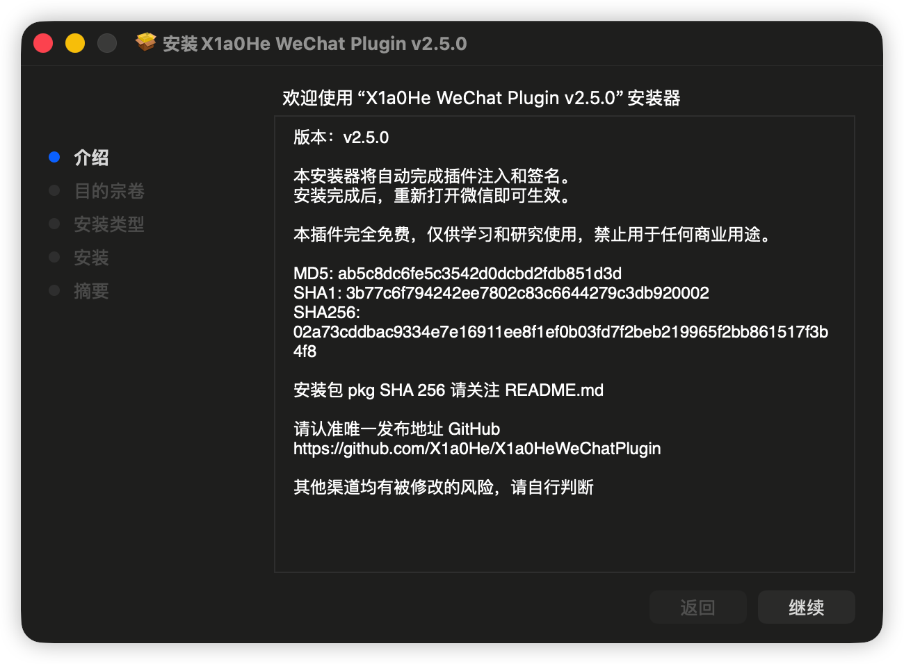
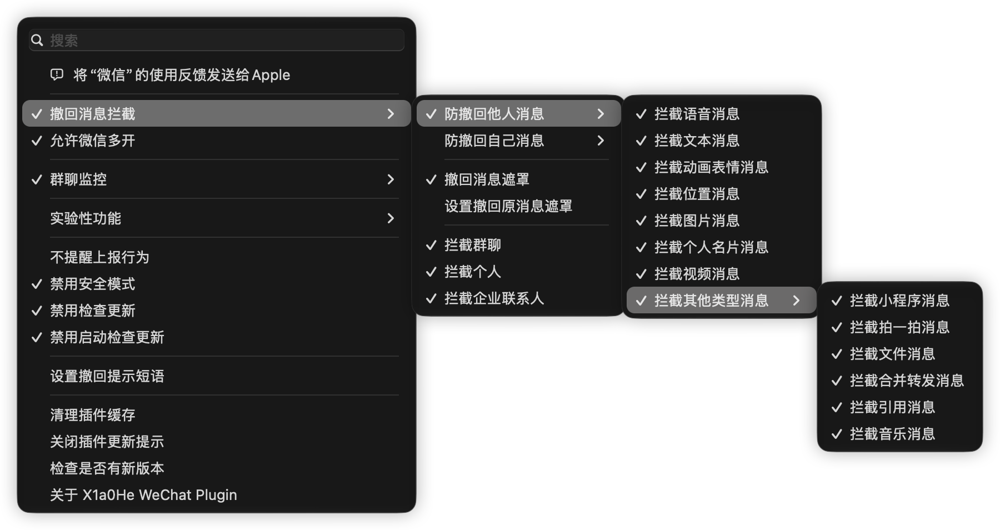
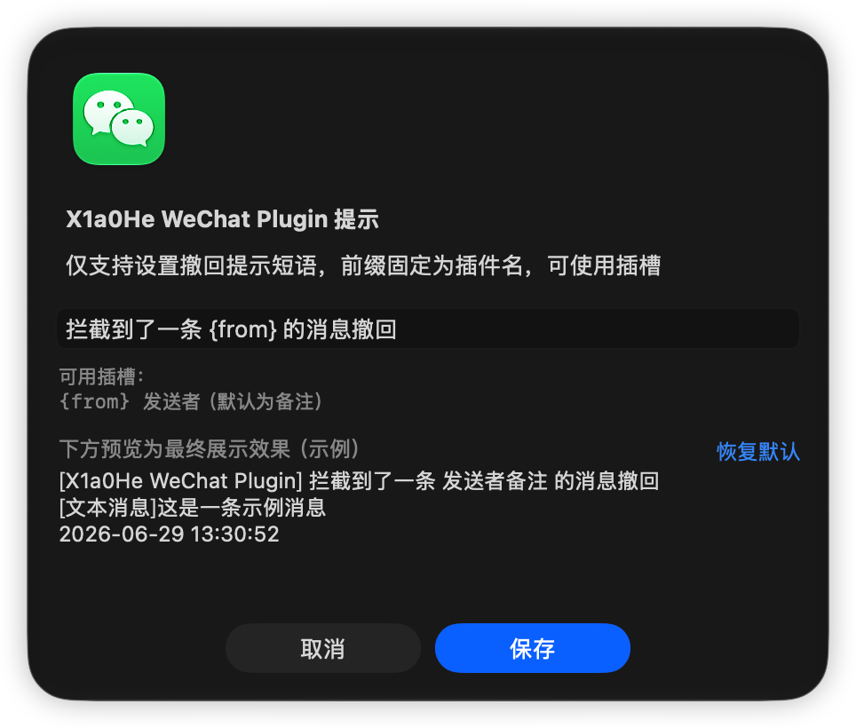

# X1a0He Plugin 2 for macOS

macOS 客户端插件

> ✅ 已在以下环境中测试通过\
> 💻 设备: M1 Max macOS 27.2 Golden Gate Beta (26B5091g)\
> 📒 微信版本: 4.1.15.52(270132)\
> ❌ 不支持 Intel 版本\
> ❌ 不支持 MAS 版本
> 
> MD5: ff8dbb06271bf767229c958bea391a90\
> SHA1: f5590f9527b7d89ce0f7d2f5c394a950370b624b\
> SHA256: d934863047c7dcbfd9c474e93c1ebc493fcada6167dbc2dd1e465741dcdd5762
> 
> 安装包 pkg SHA 256: b55a7e1b933542fd5e677c07c6f31fc014b5f7a1c4141c7afeb6be6b461ae92e

# 支持版本(点击版本或立即下载即可下载原版)
## 最新支持版本
|   版本    | 版本号 | 支持 | 需要插件版本 | 下载原版                                                                                           |
|:---------:|:------:|:----:|:------------:|----------------------------------------------------------------------------------------------------|
| 4.1.15.52 | 270132 |  ✅  |    2.11.0    | [立即下载](https://dldir1v6.qq.com/weixin/Universal/Mac/xWeChatMac_universal_4.1.15.52_270132.dmg) |

## 历史支持版本

点击展开查看支持的版本

|   版本    | 版本号 | 支持 | 需要插件版本  | 下载原版                                                                                           |
|:---------:|:------:|:----:|:-------------:|:---------------------------------------------------------------------------------------------------|
| 4.1.7.56  | 34878  |  ✅  |       -       | [立即下载](https://dldir1v6.qq.com/weixin/Universal/Mac/xWeChatMac_universal_4.1.7.56_34878.dmg)   |
| 4.1.7.57  | 34888  |  ✅  |       -       | [立即下载](https://dldir1v6.qq.com/weixin/Universal/Mac/xWeChatMac_universal_4.1.7.57_34888.dmg)   |
| 4.1.8.21  | 36420  |  ✅  |     2.1.9     | [立即下载](https://dldir1v6.qq.com/weixin/Universal/Mac/xWeChatMac_universal_4.1.8.21_36420.dmg)   |
| 4.1.8.22  | 36451  |  ✅  |     2.1.9     | [立即下载](https://dldir1v6.qq.com/weixin/Universal/Mac/xWeChatMac_universal_4.1.8.22_36451.dmg)   |
| 4.1.8.23  | 36507  |  ✅  |     2.1.9     | [立即下载](https://dldir1v6.qq.com/weixin/Universal/Mac/xWeChatMac_universal_4.1.8.23_36507.dmg)   |
| 4.1.8.26  | 36552  |  ✅  |     2.1.9     | [立即下载](https://dldir1v6.qq.com/weixin/Universal/Mac/xWeChatMac_universal_4.1.8.26_36552.dmg)   |
| 4.1.8.27  | 36559  |  ✅  |     2.1.9     | [立即下载](https://dldir1v6.qq.com/weixin/Universal/Mac/xWeChatMac_universal_4.1.8.27_36559.dmg)   |
| 4.1.8.28  | 36571  |  ✅  |     2.1.9     | [立即下载](https://dldir1v6.qq.com/weixin/Universal/Mac/xWeChatMac_universal_4.1.8.28_36571.dmg)   |
| 4.1.8.29  | 36603  |  ✅  |     2.1.9     | [立即下载](https://dldir1v6.qq.com/weixin/Universal/Mac/xWeChatMac_universal_4.1.8.29_36603.dmg)   |
| 4.1.8.50  | 36728  |  ✅  |     2.1.9     | [立即下载](https://dldir1v6.qq.com/weixin/Universal/Mac/xWeChatMac_universal_4.1.8.50_36728.dmg)   |
| 4.1.8.51  | 36777  |  ✅  |     2.1.9     | [立即下载](https://dldir1v6.qq.com/weixin/Universal/Mac/xWeChatMac_universal_4.1.8.51_36777.dmg)   |
| 4.1.8.52  | 36830  |  ✅  |     2.1.9     | [立即下载](https://dldir1v6.qq.com/weixin/Universal/Mac/xWeChatMac_universal_4.1.8.52_36830.dmg)   |
| 4.1.8.66  | 36675  |  ✅  |     2.1.9     | [立即下载](https://dldir1v6.qq.com/weixin/Universal/Mac/xWeChatMac_universal_4.1.8.66_36675.dmg)   |
| 4.1.8.67  | 36677  |  ✅  |     2.1.9     | [立即下载](https://dldir1v6.qq.com/weixin/Universal/Mac/xWeChatMac_universal_4.1.8.67_36677.dmg)   |
| 4.1.8.97  | 37189  |  ✅  |     2.1.9     | [立即下载](https://dldir1v6.qq.com/weixin/Universal/Mac/xWeChatMac_universal_4.1.8.97_37189.dmg)   |
| 4.1.8.98  | 37222  |  ✅  |     2.1.9     | [立即下载](https://dldir1v6.qq.com/weixin/Universal/Mac/xWeChatMac_universal_4.1.8.98_37222.dmg)   |
| 4.1.8.100 | 37261  |  ✅  |     2.1.9     | [立即下载](https://dldir1v6.qq.com/weixin/Universal/Mac/xWeChatMac_universal_4.1.8.100_37261.dmg)  |
| 4.1.8.101 | 37293  |  ✅  |     2.1.9     | [立即下载](https://dldir1v6.qq.com/weixin/Universal/Mac/xWeChatMac_universal_4.1.8.101_37293.dmg)  |
| 4.1.8.104 | 37303  |  ✅  |     2.1.9     | [立即下载](https://dldir1v6.qq.com/weixin/Universal/Mac/xWeChatMac_universal_4.1.8.104_37303.dmg)  |
| 4.1.8.105 | 37331  |  ✅  |     2.1.9     | [立即下载](https://dldir1v6.qq.com/weixin/Universal/Mac/xWeChatMac_universal_4.1.8.105_37331.dmg)  |
| 4.1.8.106 | 37335  |  ✅  |     2.1.9     | [立即下载](https://dldir1v6.qq.com/weixin/Universal/Mac/xWeChatMac_universal_4.1.8.106_37335.dmg)  |
| 4.1.9.21  | 37997  |  ✅  |     2.2.0     | [立即下载](https://dldir1v6.qq.com/weixin/Universal/Mac/xWeChatMac_universal_4.1.9.21_37997.dmg)   |
| 4.1.9.22  | 38023  |  ✅  |     2.2.0     | [立即下载](https://dldir1v6.qq.com/weixin/Universal/Mac/xWeChatMac_universal_4.1.9.22_38023.dmg)   |
| 4.1.9.23  | 38031  |  ✅  |     2.3.0     | [立即下载](https://dldir1v6.qq.com/weixin/Universal/Mac/xWeChatMac_universal_4.1.9.23_38031.dmg)   |
| 4.1.9.26  | 38109  |  ✅  |     2.3.0     | [立即下载](https://dldir1v6.qq.com/weixin/Universal/Mac/xWeChatMac_universal_4.1.9.26_38109.dmg)   |
| 4.1.9.27  | 38157  |  ✅  |     2.3.1     | [立即下载](https://dldir1v6.qq.com/weixin/Universal/Mac/xWeChatMac_universal_4.1.9.27_38157.dmg)   |
| 4.1.9.29  | 38164  |  ✅  |     2.3.1     | [立即下载](https://dldir1v6.qq.com/weixin/Universal/Mac/xWeChatMac_universal_4.1.9.29_38164.dmg)   |
| 4.1.9.31  | 38495  |  ✅  |       -       | [立即下载](https://dldir1v6.qq.com/weixin/Universal/Mac/xWeChatMac_universal_4.1.9.31_38495.dmg)   |
| 4.1.9.51  | 38789  |  ✅  |       -       | [立即下载](https://dldir1v6.qq.com/weixin/Universal/Mac/xWeChatMac_universal_4.1.9.51_38789.dmg)   |
| 4.1.9.52  | 38814  |  ✅  |       -       | [立即下载](https://dldir1v6.qq.com/weixin/Universal/Mac/xWeChatMac_universal_4.1.9.52_38814.dmg)   |
| 4.1.9.53  | 38815  |  ✅  |       -       | [立即下载](https://dldir1v6.qq.com/weixin/Universal/Mac/xWeChatMac_universal_4.1.9.53_38815.dmg)   |
| 4.1.9.54  | 38889  |  ✅  |       -       | [立即下载](https://dldir1v6.qq.com/weixin/Universal/Mac/xWeChatMac_universal_4.1.9.54_38889.dmg)   |
| 4.1.9.55  | 38902  |  ✅  |       -       | [立即下载](https://dldir1v6.qq.com/weixin/Universal/Mac/xWeChatMac_universal_4.1.9.55_38902.dmg)   |
| 4.1.9.56  | 38926  |  ✅  |       -       | [立即下载](https://dldir1v6.qq.com/weixin/Universal/Mac/xWeChatMac_universal_4.1.9.56_38926.dmg)   |
| 4.1.9.57  | 38937  |  ✅  | 2.4.0 / 2.4.1 | [立即下载](https://dldir1v6.qq.com/weixin/Universal/Mac/xWeChatMac_universal_4.1.9.57_38937.dmg)   |
| 4.1.9.58  | 38959  |  ✅  |     2.4.2     | [立即下载](https://dldir1v6.qq.com/weixin/Universal/Mac/xWeChatMac_universal_4.1.9.58_38959.dmg)   |
| 4.1.10.19 | 39521  |  ✅  |     2.4.2     | [立即下载](https://dldir1v6.qq.com/weixin/Universal/Mac/xWeChatMac_universal_4.1.10.19_39521.dmg)  |
| 4.1.10.22 | 39580  |  ✅  |     2.4.4     | [立即下载](https://dldir1v6.qq.com/weixin/Universal/Mac/xWeChatMac_universal_4.1.10.22_39580.dmg)  |
| 4.1.10.23 | 39585  |  ✅  |     2.4.4     | [立即下载](https://dldir1v6.qq.com/weixin/Universal/Mac/xWeChatMac_universal_4.1.10.23_39585.dmg)  |
| 4.1.10.24 | 39588  |  ✅  |     2.4.4     | [立即下载](https://dldir1v6.qq.com/weixin/Universal/Mac/xWeChatMac_universal_4.1.10.24_39588.dmg)  |
| 4.1.10.25 | 39600  |  ✅  |     2.4.4     | [立即下载](https://dldir1v6.qq.com/weixin/Universal/Mac/xWeChatMac_universal_4.1.10.25_39600.dmg)  |
| 4.1.10.26 | 39601  |  ✅  |     2.4.4     | [立即下载](https://dldir1v6.qq.com/weixin/Universal/Mac/xWeChatMac_universal_4.1.10.26_39601.dmg)  |
| 4.1.10.31 | 39618  |  ✅  |     2.4.5     | [立即下载](https://dldir1v6.qq.com/weixin/Universal/Mac/xWeChatMac_universal_4.1.10.31_39618.dmg)  |
| 4.1.10.49 | 39892  |  ✅  |     2.4.6     | [立即下载](https://dldir1v6.qq.com/weixin/Universal/Mac/xWeChatMac_universal_4.1.10.49_39892.dmg)  |
| 4.1.10.50 | 39893  |  ✅  |     2.4.6     | [立即下载](https://dldir1v6.qq.com/weixin/Universal/Mac/xWeChatMac_universal_4.1.10.50_39893.dmg)  |
| 4.1.10.51 | 39907  |  ✅  |     2.4.6     | [立即下载](https://dldir1v6.qq.com/weixin/Universal/Mac/xWeChatMac_universal_4.1.10.51_39907.dmg)  |
| 4.1.10.52 | 39910  |  ✅  |     2.4.6     | [立即下载](https://dldir1v6.qq.com/weixin/Universal/Mac/xWeChatMac_universal_4.1.10.52_39910.dmg)  |
| 4.1.10.53 | 39917  |  ✅  |     2.4.7     | [立即下载](https://dldir1v6.qq.com/weixin/Universal/Mac/xWeChatMac_universal_4.1.10.53_39917.dmg)  |
| 4.1.11.19 | 40431  |  ✅  |     2.4.7     | [立即下载](https://dldir1v6.qq.com/weixin/Universal/Mac/xWeChatMac_universal_4.1.11.19_40431.dmg)  |
| 4.1.11.21 | 40446  |  ✅  |     2.4.7     | [立即下载](https://dldir1v6.qq.com/weixin/Universal/Mac/xWeChatMac_universal_4.1.11.21_40446.dmg)  |
| 4.1.11.22 | 40419  |  ✅  |       -       | [立即下载](https://dldir1v6.qq.com/weixin/Universal/Mac/xWeChatMac_universal_4.1.11.22_40419.dmg)  |
| 4.1.11.23 | 40493  |  ✅  |     2.5.0     | [立即下载](https://dldir1v6.qq.com/weixin/Universal/Mac/xWeChatMac_universal_4.1.11.23_40493.dmg)  |
| 4.1.11.49 | 41704  |  ✅  |       -       | [立即下载](https://dldir1v6.qq.com/weixin/Universal/Mac/xWeChatMac_universal_4.1.11.49_41704.dmg)  |
| 4.1.11.50 | 41715  |  ✅  |     2.6.0     | [立即下载](https://dldir1v6.qq.com/weixin/Universal/Mac/xWeChatMac_universal_4.1.11.50_41715.dmg)  |
| 4.1.11.52 | 41747  |  ✅  |     2.6.1     | [立即下载](https://dldir1v6.qq.com/weixin/Universal/Mac/xWeChatMac_universal_4.1.11.52_41747.dmg)  |
| 4.1.11.53 | 41748  |  ✅  |     2.6.1     | [立即下载](https://dldir1v6.qq.com/weixin/Universal/Mac/xWeChatMac_universal_4.1.11.53_41748.dmg)  |
| 4.1.11.54 | 41754  |  ✅  |     2.6.2     | [立即下载](https://dldir1v6.qq.com/weixin/Universal/Mac/xWeChatMac_universal_4.1.11.54_41754.dmg)  |
| 4.1.12.19 | 42414  |  ✅  |     2.6.3     | [立即下载](https://dldir1v6.qq.com/weixin/Universal/Mac/xWeChatMac_universal_4.1.12.19_42414.dmg)  |
| 4.1.12.20 | 42432  |  ✅  |     2.6.3     | [立即下载](https://dldir1v6.qq.com/weixin/Universal/Mac/xWeChatMac_universal_4.1.12.20_42432.dmg)  |
| 4.1.12.21 | 42489  |  ✅  |     2.6.3     | [立即下载](https://dldir1v6.qq.com/weixin/Universal/Mac/xWeChatMac_universal_4.1.12.21_42489.dmg)  |
| 4.1.12.22 | 42530  |  ✅  |     2.6.4     | [立即下载](https://dldir1v6.qq.com/weixin/Universal/Mac/xWeChatMac_universal_4.1.12.22_42530.dmg)  |
| 4.1.12.23 | 269335 |  ✅  |     2.6.4     | [立即下载](https://dldir1v6.qq.com/weixin/Universal/Mac/xWeChatMac_universal_4.1.12.23_269335.dmg) |
| 4.1.12.24 | 269336 |  ✅  |     2.6.4     | [立即下载](https://dldir1v6.qq.com/weixin/Universal/Mac/xWeChatMac_universal_4.1.12.24_269336.dmg) |
| 4.1.12.25 | 269337 |  ✅  |     2.6.4     | [立即下载](https://dldir1v6.qq.com/weixin/Universal/Mac/xWeChatMac_universal_4.1.12.25_269337.dmg) |
| 4.1.12.26 | 269338 |  ✅  |     2.6.4     | [立即下载](https://dldir1v6.qq.com/weixin/Universal/Mac/xWeChatMac_universal_4.1.12.26_269338.dmg) |
| 4.1.12.27 | 269339 |  ✅  |     2.6.4     | [立即下载](https://dldir1v6.qq.com/weixin/Universal/Mac/xWeChatMac_universal_4.1.12.27_269339.dmg) |
| 4.1.12.28 | 269340 |  ✅  |     2.6.4     | [立即下载](https://dldir1v6.qq.com/weixin/Universal/Mac/xWeChatMac_universal_4.1.12.28_269340.dmg) |
| 4.1.12.29 | 269341 |  ✅  |     2.6.4     | [立即下载](https://dldir1v6.qq.com/weixin/Universal/Mac/xWeChatMac_universal_4.1.12.29_269341.dmg) |
| 4.1.12.50 | 269362 |  ✅  |     2.7.0     | [立即下载](https://dldir1v6.qq.com/weixin/Universal/Mac/xWeChatMac_universal_4.1.12.50_269362.dmg) |
| 4.1.12.51 | 269363 |  ✅  |     2.7.0     | [立即下载](https://dldir1v6.qq.com/weixin/Universal/Mac/xWeChatMac_universal_4.1.12.51_269363.dmg) |
| 4.1.12.52 | 269364 |  ✅  |     2.7.0     | [立即下载](https://dldir1v6.qq.com/weixin/Universal/Mac/xWeChatMac_universal_4.1.12.52_269364.dmg) |
| 4.1.12.53 | 269365 |  ✅  |       -       | [立即下载](https://dldir1v6.qq.com/weixin/Universal/Mac/xWeChatMac_universal_4.1.12.53_269365.dmg) |
| 4.1.13.5  | 269573 |  ✅  |       -       | [立即下载](https://dldir1v6.qq.com/weixin/Universal/Mac/xWeChatMac_universal_4.1.13.5_269573.dmg)  |
| 4.1.13.6  | 269574 |  ✅  |     2.8.0     | [立即下载](https://dldir1v6.qq.com/weixin/Universal/Mac/xWeChatMac_universal_4.1.13.6_269574.dmg)  |
| 4.1.13.7  | 269575 |  ✅  |     2.8.1     | [立即下载](https://dldir1v6.qq.com/weixin/Universal/Mac/xWeChatMac_universal_4.1.13.7_269575.dmg)  |
| 4.1.13.8  | 269576 |  ✅  |       -       | [立即下载](https://dldir1v6.qq.com/weixin/Universal/Mac/xWeChatMac_universal_4.1.13.8_269576.dmg)  |
| 4.1.13.9  | 269577 |  ✅  |       -       | [立即下载](https://dldir1v6.qq.com/weixin/Universal/Mac/xWeChatMac_universal_4.1.13.9_269577.dmg)  |
| 4.1.13.10 | 269578 |  ✅  |     2.8.2     | [立即下载](https://dldir1v6.qq.com/weixin/Universal/Mac/xWeChatMac_universal_4.1.13.10_269578.dmg) |
| 4.1.13.11 | 269579 |  ✅  |       -       | [立即下载](https://dldir1v6.qq.com/weixin/Universal/Mac/xWeChatMac_universal_4.1.13.11_269579.dmg) |
| 4.1.13.50 | 269618 |  ✅  |       -       | [立即下载](https://dldir1v6.qq.com/weixin/Universal/Mac/xWeChatMac_universal_4.1.13.50_269618.dmg) |
| 4.1.13.51 | 269619 |  ✅  |     2.8.3     | [立即下载](https://dldir1v6.qq.com/weixin/Universal/Mac/xWeChatMac_universal_4.1.13.51_269619.dmg) |
| 4.1.13.56 | 269624 |  ✅  |     2.9.0     | [立即下载](https://dldir1v6.qq.com/weixin/Universal/Mac/xWeChatMac_universal_4.1.13.56_269624.dmg) |
| 4.1.13.57 | 269625 |  ✅  |     2.9.0     | [立即下载](https://dldir1v6.qq.com/weixin/Universal/Mac/xWeChatMac_universal_4.1.13.57_269625.dmg) |
| 4.1.13.58 | 269626 |  ✅  |     2.9.0     | [立即下载](https://dldir1v6.qq.com/weixin/Universal/Mac/xWeChatMac_universal_4.1.13.58_269626.dmg) |
| 4.1.13.59 | 269627 |  ✅  |     2.9.0     | [立即下载](https://dldir1v6.qq.com/weixin/Universal/Mac/xWeChatMac_universal_4.1.13.59_269627.dmg) |
| 4.1.13.60 | 269628 |  ✅  |     2.9.0     | [立即下载](https://dldir1v6.qq.com/weixin/Universal/Mac/xWeChatMac_universal_4.1.13.60_269628.dmg) |
| 4.1.13.61 | 269629 |  ✅  |     2.9.0     | [立即下载](https://dldir1v6.qq.com/weixin/Universal/Mac/xWeChatMac_universal_4.1.13.61_269629.dmg) |
| 4.1.13.62 | 269630 |  ✅  |     2.9.0     | [立即下载](https://dldir1v6.qq.com/weixin/Universal/Mac/xWeChatMac_universal_4.1.13.62_269630.dmg) |
| 4.1.13.63 | 269631 |  ✅  |     2.9.0     | [立即下载](https://dldir1v6.qq.com/weixin/Universal/Mac/xWeChatMac_universal_4.1.13.63_269631.dmg) |
| 4.1.15.4  | 270084 |  ✅  |     2.9.0     | [立即下载](https://dldir1v6.qq.com/weixin/Universal/Mac/xWeChatMac_universal_4.1.15.4_270084.dmg)  |
| 4.1.15.5  | 270085 |  ✅  |     2.9.0     | [立即下载](https://dldir1v6.qq.com/weixin/Universal/Mac/xWeChatMac_universal_4.1.15.5_270085.dmg)  |
| 4.1.15.6  | 270086 |  ✅  |     2.9.0     | [立即下载](https://dldir1v6.qq.com/weixin/Universal/Mac/xWeChatMac_universal_4.1.15.6_270086.dmg)  |
| 4.1.15.8  | 270088 |  ✅  |     2.9.0     | [立即下载](https://dldir1v6.qq.com/weixin/Universal/Mac/xWeChatMac_universal_4.1.15.8_270088.dmg)  |
| 4.1.15.9  | 270089 |  ✅  |     2.9.0     | [立即下载](https://dldir1v6.qq.com/weixin/Universal/Mac/xWeChatMac_universal_4.1.15.9_270089.dmg)  |
| 4.1.15.10 | 270090 |  ✅  |     2.9.0     | [立即下载](https://dldir1v6.qq.com/weixin/Universal/Mac/xWeChatMac_universal_4.1.15.10_270090.dmg) |
| 4.1.15.11 | 270091 |  ✅  |    2.10.0     | [立即下载](https://dldir1v6.qq.com/weixin/Universal/Mac/xWeChatMac_universal_4.1.15.11_270091.dmg) |
| 4.1.15.13 | 270093 |  ✅  |    2.10.0     | [立即下载](https://dldir1v6.qq.com/weixin/Universal/Mac/xWeChatMac_universal_4.1.15.13_270093.dmg) |
| 4.1.15.14 | 270094 |  ✅  |    2.10.0     | [立即下载](https://dldir1v6.qq.com/weixin/Universal/Mac/xWeChatMac_universal_4.1.15.14_270094.dmg) |
| 4.1.15.15 | 270095 |  ✅  |    2.10.0     | [立即下载](https://dldir1v6.qq.com/weixin/Universal/Mac/xWeChatMac_universal_4.1.15.15_270095.dmg) |
| 4.1.15.16 | 270096 |  ✅  |    2.10.0     | [立即下载](https://dldir1v6.qq.com/weixin/Universal/Mac/xWeChatMac_universal_4.1.15.16_270096.dmg) |
| 4.1.15.17 | 270097 |  ✅  |    2.10.0     | [立即下载](https://dldir1v6.qq.com/weixin/Universal/Mac/xWeChatMac_universal_4.1.15.17_270097.dmg) |
| 4.1.15.18 | 270098 |  ✅  |    2.10.0     | [立即下载](https://dldir1v6.qq.com/weixin/Universal/Mac/xWeChatMac_universal_4.1.15.18_270098.dmg) |
| 4.1.15.19 | 270099 |  ✅  |    2.10.0     | [立即下载](https://dldir1v6.qq.com/weixin/Universal/Mac/xWeChatMac_universal_4.1.15.19_270099.dmg) |
| 4.1.15.20 | 270100 |  ✅  |    2.10.0     | [立即下载](https://dldir1v6.qq.com/weixin/Universal/Mac/xWeChatMac_universal_4.1.15.20_270100.dmg) |
| 4.1.15.21 | 270101 |  ✅  |    2.11.0     | [立即下载](https://dldir1v6.qq.com/weixin/Universal/Mac/xWeChatMac_universal_4.1.15.21_270101.dmg) |
| 4.1.15.22 | 270102 |  ✅  |    2.11.0     | [立即下载](https://dldir1v6.qq.com/weixin/Universal/Mac/xWeChatMac_universal_4.1.15.22_270102.dmg) |
| 4.1.15.51 | 270131 |  ✅  |    2.11.0     | [立即下载](https://dldir1v6.qq.com/weixin/Universal/Mac/xWeChatMac_universal_4.1.15.51_270131.dmg) |

# 目录

<!-- TOC -->
* [X1a0He Plugin 2 for macOS](#x1a0he-plugin-2-for-macos)
* [支持版本(点击版本或立即下载即可下载原版)](#支持版本点击版本或立即下载即可下载原版)
  * [最新支持版本](#最新支持版本)
  * [历史支持版本](#历史支持版本)
* [目录](#目录)
* [如何安装](#如何安装)
  * [步骤](#步骤)
    * [使用 pkg 一键安装](#使用-pkg-一键安装)
* [📝更新日志](#更新日志)
    * [2.10.0 (2026.09.19)](#2100-20260919)
* [FAQ](#faq)
  * [pkg 出现安装失败？](#pkg-出现安装失败)
* [插件菜单预览](#插件菜单预览)
* [✨功能](#功能)
* [👨🏻‍💻作者](#作者)
<!-- TOC -->

# 如何安装

## 步骤

### 使用 pkg 一键安装

# 📝更新日志

- **更多更新日志，请查看 [更新日志](change-log.md)**

### 2.11.0 (2026.10.01)

1. feat: 完善微信 270101、270102、270131、270132 的兼容适配，保留旧版支持。
2. feat: 新增“复读+1”功能，可通过消息右键菜单快速复读到当前会话。
3. feat: 新增语音复读与语音转发，支持复读到当前会话，或选择好友、群聊转发。
4. feat: 新增动画表情快速导出，支持将微信专用格式转换为 GIF 保存。
5. feat: 新增“不限制聊天转发数量”开关。
6. feat: 支持置顶聊天折叠入口始终显示，并可选择放在顶部或底部，设置实时生效。
7. feat: 发现页和侧边栏隐藏设置支持即时生效，无需重启微信。
8. feat: 通讯录及全部好友、群聊选择器改用原生读取，不再直接查询 contact.db；统一分类折叠、分组排序、全量加载、搜索及数量显示。
9. feat: 新增自动领取红包与自动收款，支持固定、随机、模拟人工延时，以及黑白名单、好友和群聊自定义规则、成功次数统计。
10. feat: 支持自动领取自己发送的群红包，默认关闭；优先使用群规则，其次使用本人好友规则，最后使用全局设置。
11. feat: 新增红包、转账接收提醒及领取、收款结果提醒，本机通知与文字转发可独立开关，并分别设置转发目标。
12. feat: 支持自定义通知标题、正文及转发内容，提供占位符说明、实时预览和恢复默认，并统一接入提示前缀设置。
13. feat: 红包领取结果支持显示实领金额；优化消息来源展示，群聊统一显示为“群名•发送人”。
14. feat: 新增语音功能使用说明与免责声明，以及自动领取红包、自动收款的账号风险确认提示。
15. feat: 统一撤回与退群提示的名称解析和模板规则，支持按备注、昵称、微信号、wxid 显示及兜底，撤回提示支持点击打开资料卡。
16. feat: 撤回用户支持直接点击查看资料卡
17. fix: 改进撤回消息背景匹配及刷新，减少消息视图复用导致的背景错位，并支持随历史消息加载恢复标记。
18. fix: 修复置顶聊天折叠设置菜单无法点击、退群提示开关切换后漏报，以及语音转发选择窗口可能触发崩溃的问题。
19. fix: 完善支付操作的账号切换校验与重复处理防护；响应无法确认时显示“结果未知”并暂停后续自动操作，避免误报失败

<a href="https://www.star-history.com/?repos=X1a0He%2FX1a0HeWeChatPlugin&type=date&legend=top-left">
 <picture>
   <source media="(prefers-color-scheme: dark)" srcset="https://api.star-history.com/chart?repos=X1a0He/X1a0HeWeChatPlugin&type=date&theme=dark&legend=top-left&sealed_token=A3hjLThFM2P089BGXUCZYY-myd5Vz3Pjjni7qWuzSWKb4ZKQW_jD3gAF3MTDiyjthZKC9Uxgol9o20JHlFnwzB3LjVF2yDx_8c0SfAUOY4ilASxzUhBx9Q" />
   <source media="(prefers-color-scheme: light)" srcset="https://api.star-history.com/chart?repos=X1a0He/X1a0HeWeChatPlugin&type=date&legend=top-left&sealed_token=A3hjLThFM2P089BGXUCZYY-myd5Vz3Pjjni7qWuzSWKb4ZKQW_jD3gAF3MTDiyjthZKC9Uxgol9o20JHlFnwzB3LjVF2yDx_8c0SfAUOY4ilASxzUhBx9Q" />
   
 </picture>
</a>

# FAQ

## pkg 出现安装失败？
> 请先检查是否已完全退出微信

安装插件需要完全退出微信

> 已经完全退出了微信，但还是失败？

可能是没安装开发者组件导致的，安装插件需要开发者组件\
`command` + `空格`输入`终端`，回车后，在终端输入 `otool` 回车，激活开发者组件下载

- **会封号吗？**

> 所有处理均为本地处理，不经过任何网络传输，有能力的可以自行抓包检测\
> ⚠️ 多开功能不建议使用，因为本来官方就不支持多开

- **录屏权限未开启？**
> 前往设置中对微信的录屏权限进行打开\
> 若打开后仍不生效，请点击减号删除微信重新添加，重启App即可
# 插件菜单预览

# ✨功能

- [x] 消息撤回拦截
    - [x] 防撤回他人消息
        - [x] 拦截语音消息
        - [x] 拦截动画表情消息
        - [x] 拦截位置消息
        - [x] 拦截图片消息
        - [x] 拦截文本消息
        - [x] 拦截个人名片消息
        - [x] 拦截视频消息
        - [x] 拦截其他类型消息
            - [x] 拦截小程序消息
            - [x] 拦截拍一拍消息
            - [x] 拦截文件消息
            - [x] 拦截合并转发消息
            - [x] 拦截引用消息
            - [x] 拦截音乐消息
    - [x] 防撤回自己消息【功能同上】
    - [x] 消息撤回过滤
      - [x] 黑名单(名单内不拦截)
      - [x] 白名单(仅名单内拦截)
    - [x] 撤回消息遮罩
    - [x] 设置撤回原消息遮罩
    - [x] 撤回消息通知
    - [x] 消息撤回转发
      - [x] 转发文字
      - [x] 转发图片
      - [x] 转发视频
      - [x] 转发文件
    - [x] 消息撤回转发目标设置
    - [x] 自定义设置撤回提示短语
- [x] 允许微信多开 ⚠️请慎用该功能
- [x] 群聊功能
  - [x] 群成员退出监控
  - [x] 设置退群监控短语
  - [x] 退群提示成员可点击
  - [x] 显示非好友共同群聊
- [x] 聊天设置
    - [x] 不限制聊天转发数量
    - [x] 启用快速复读
    - [x] 快速导出动画表情
    - [x] 启用复读语音
    - [x] 启用转发语音
- [x] 显示设置
  - [x] 显示提示前缀
  - [x] 自定义前缀
  - [x] 菜单栏名称
- [x] 禁用日志上报
- [x] 禁用安全模式
- [x] 禁用检测更新
- [x] 禁用启动检查更新
- [x] 屏蔽侧边栏
  - [x] 游戏中心
  - [x] 搜一搜
  - [x] 视频号
- [x] 屏蔽发现页
    - [x] 视频号
    - [x] 搜一搜
    - [x] 游戏
    - [x] 小程序
- [x] 链接打开行为接管
  - [x] 原生行为(不接管)
  - [x] 统一默认浏览器打开
  - [x] 统一右侧打开
  - [x] 统一独立窗口打开
  - [x] 自定义
- [x] 红包设置
    - [x] 接收提醒
    - [x] 自动领取
    - [x] 领取结果提醒
- [x] 转账设置
    - [x] 接收提醒
    - [x] 自动领取
    - [x] 领取结果提醒
- [x] 检测插件是否有新版本

# 👨🏻‍💻作者

X1a0He Plugin 2 for macOS © X1a0He

Created on 2025.01.20

> GitHub [@X1a0He](https://github.com/X1a0He/) \
> Telegram [@X1a0He](https://t.me/X1a0He_bot)
