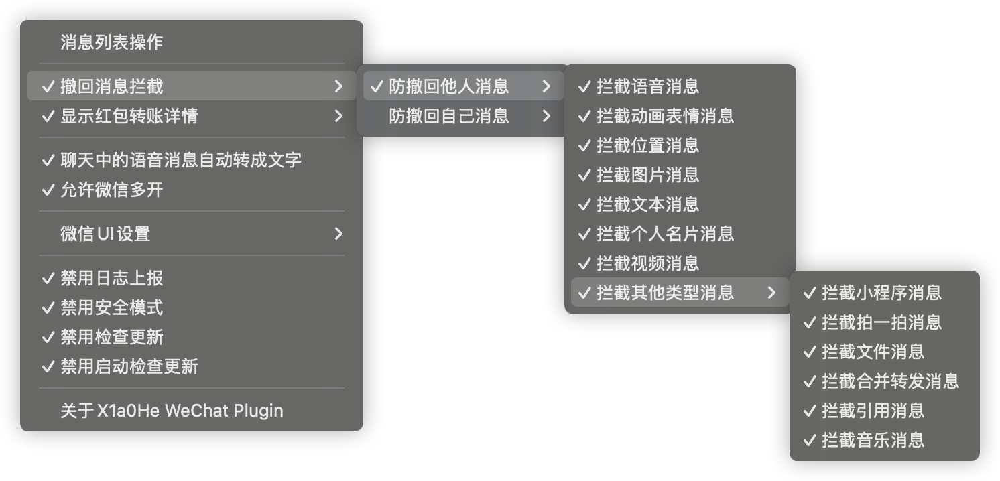
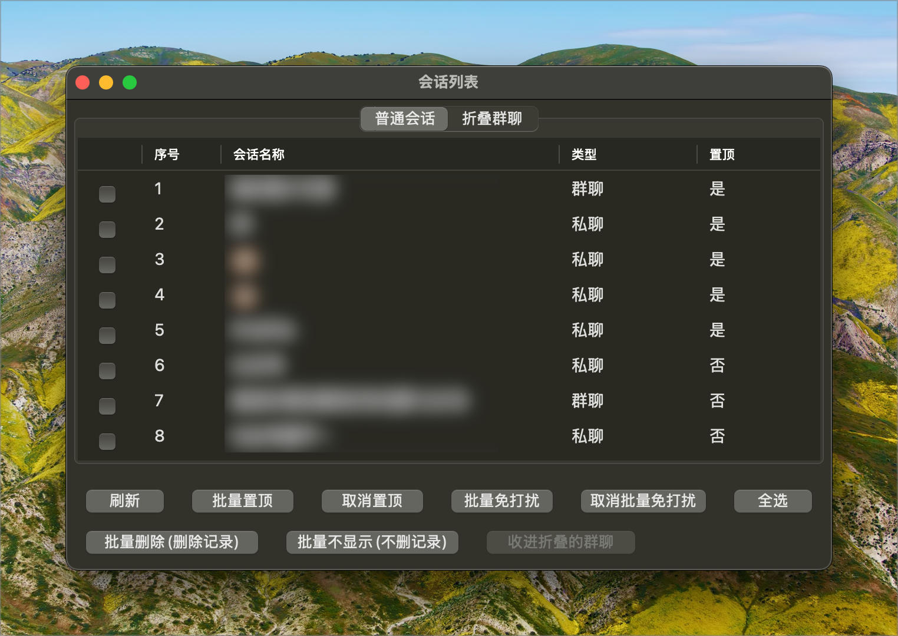

# X1a0He WeChat Plugin for macOS


[](https://github.com/X1a0He/X1a0HeWeChatPlugin/releases)


macOS 微信客户端插件


# 目录

* [X1a0He WeChat Plugin for macOS](#x1a0he-wechat-plugin-for-macos)
* [如何安装](#如何安装)
    * [必要步骤](#必要步骤)
        * [已安装 Git 的用户](#已安装-git-的用户)
        * [未安装 Git 的用户](#未安装-git-的用户)
* [插件菜单预览](#插件菜单预览)
* [消息列表操作预览](#消息列表操作预览)
* [✨功能](#功能)
* [📝更新日志](#更新日志)
* [使用须知](#使用须知)
* [FAQ](#faq)
* [👨🏻‍💻作者](#作者)

# 如何安装

> 注意: 执行脚本需要输入你的 Mac 密码

## 必要步骤

### 已安装 Git 的用户

**Mac 上安装了 Git 的可以直接克隆仓库后执行脚本**

```shell
git clone https://github.com/X1a0He/X1a0HeWeChatPlugin.git
cd X1a0HeWeChatPlugin
sudo sh install.sh
```

### 未安装 Git 的用户

- 下载完整仓库压缩包后解压到相关目录\
  

- 完成解压后，打开`终端`\
  

执行以下命令

```shell
cd X1a0HeWeChatPlugin目录
sudo sh install.sh
```

**等待安装完成即可**

# 插件菜单预览



# 消息列表操作预览

消息列表操作功能是为了可以更方便对微信消息进行批量管理，包括

- 批量置顶/取消置顶
- 批量免打扰/取消免打扰
- 批量删除
- 批量不显示
- 批量收进「折叠的群聊」(仅针对群聊)
- 批量移除「折叠的群聊」



# ✨功能

- [x] 消息列表操作
- [x] 消息撤回拦截
    - [x] 防撤回他人消息
        - [x] 拦截语音消息
        - [x] 拦截动画表情消息
        - [x] 拦截位置消息
        - [x] 拦截图片消息
        - [x] 拦截文本消息
        - [x] 拦截个人名片消息
        - [x] 拦截视频消息
        - [x] 拦截其他类型消息
            - [x] 拦截小程序消息
            - [x] 拦截拍一拍消息
            - [x] 拦截文件消息
            - [x] 拦截合并转发消息
            - [x] 拦截引用消息
            - [x] 拦截音乐消息
    - [x] 防撤回自己消息【功能同上】
- [x] 显示红包转账详情
    - [x] 显示红包详情【不支持显示金额】
    - [x] 显示转账详情
- [x] 聊天中的语音消息自动转成文字【调用的微信自带功能】
- [x] 允许微信多开 ⚠️请慎用该功能
- [x] 微信 UI 设置
    - [x] 毛玻璃模式
    - [x] 头像圆角显示
- [x] 禁用日志上报
- [x] 禁用安全模式
- [x] 禁用检测更新
- [x] 禁用启动检查更新
- [x] 检测插件是否有新版本

# 📝更新日志

- **更多更新日志，请查看 [更新日志](change-log.md)**

### 1.0.3 (2025.01.25)

- 修复了部分情况在 MAS 和 官方版本之间因检测更新而崩溃的问题
- 修复了插件检测更新频率过多导致 GitHub 403 的问题
- 修复了一些安全性问题

<a href="https://star-history.com/#X1a0He/X1a0HeWeChatPlugin&Timeline">
 <picture>
   <source media="(prefers-color-scheme: dark)" srcset="https://api.star-history.com/svg?repos=X1a0He/X1a0HeWeChatPlugin&type=Timeline&theme=dark" />
   <source media="(prefers-color-scheme: light)" srcset="https://api.star-history.com/svg?repos=X1a0He/X1a0HeWeChatPlugin&type=Timeline" />
   
 </picture>
</a>

# 使用须知

**1. 不接受任何新功能请求**\
**2. 不接受任何类似以下几点的无脑issue**\

- 怎么用？不会用？
- 会不会封号？
- 能支持 4.X 版本吗
- 可以开源吗？

> ✅ 已在以下环境中测试通过\
> 💻 设备: M1 Max macOS Sequoia 15.2\
> 📒 版本: Version. 3.8.10 (28632)

|   版本   |  版本号  | 状态 | Arm | Intel |
|:------:|:-----:|:--:|:---:|:-----:|
| 3.8.10 | 28632 | ✅  |  ✅  |   ✅   |
| 3.8.9  |       | ✅  |  ✅  |   ✅   |

> ❌❌❌ 不支持测试版，也不会支持 版本 4.X

# FAQ

- **会封号吗？**

> 所有处理均为本地处理，不经过任何网络传输，有能力的可以自行抓包检测\
> ⚠️ 多开功能不建议使用，因为本来官方就不支持多开

- **为什么不开源？有安全和隐私问题吗？**

> 为什么要开源？用人不疑，疑人不用\
> 另外，我不关心你的聊天记录，也不关心你的设备有多好，更不关心你的微信有多少钱，也不关心你人在哪里\
> 所以不会有任何安全和隐私问题，你可以放心使用，不放心随便检测

# 👨🏻‍💻作者

X1a0He WeChat Plugin for macOS © X1a0He

Created on 2025.01.20

> GitHub [@X1a0He](https://github.com/X1a0He/) \
> Telegram [@X1a0He](https://t.me/X1a0He)